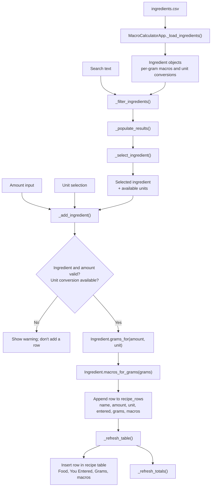

```mermaid 
flowchart TD
    CSV["ingredients.csv"] --> LOAD["MacroCalculatorApp._load_ingredients()"]
    LOAD --> DB["Ingredient objects<br/>per-gram macros and unit conversions"]

    SEARCH["Search text"] --> FILTER["_filter_ingredients()"]
    DB --> FILTER
    FILTER --> RESULTS["_populate_results()"]
    RESULTS --> PICK["_select_ingredient()"]
    PICK --> SELECTED["Selected ingredient<br/>+ available units"]

    AMOUNT["Amount input"] --> ADD["_add_ingredient()"]
    UNIT["Unit selection"] --> ADD
    SELECTED --> ADD

    ADD --> VALID{"Ingredient and amount valid?<br/>Unit conversion available?"}
    VALID -- No --> WARN["Show warning; don't add a row"]
    VALID -- Yes --> GRAMS["Ingredient.grams_for(amount, unit)"]
    GRAMS --> MACROS["Ingredient.macros_for_grams(grams)"]
    MACROS --> APPEND["Append row to recipe_rows<br/>name, amount, unit, entered, grams, macros"]
    APPEND --> REFRESH["_refresh_table()"]
    REFRESH --> ROW["Insert row in recipe table<br/>Food, You Entered, Grams, macros"]
    REFRESH --> TOTALS["_refresh_totals()"]
```  